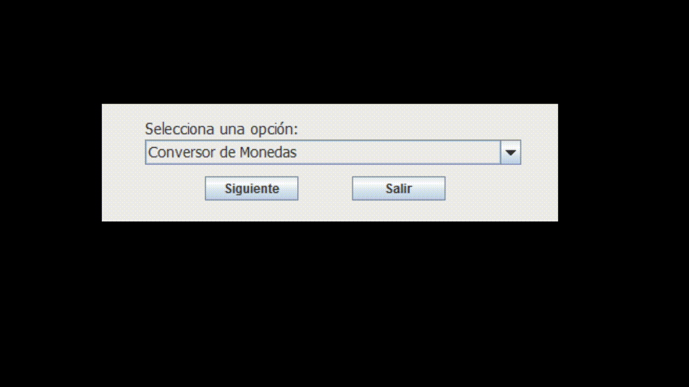

# Aplicacion Conversor

## Instrucciones
Esta  aplicación permite convertir monedas o distancias. Para poder hacerlo debes ingresar a las opciones que figuran en el menú:

## 1. Convertir Monedas
En este caso se podran cambiar monedas de varias valuaciones, como demostramos en el video:

## 2. Convertir Unidades de distancia
En este caso se podra convertir las medidas ingresando el valor inicial y seleccionar la unidad de medida final para saber su relación, como demostramos en el video:

